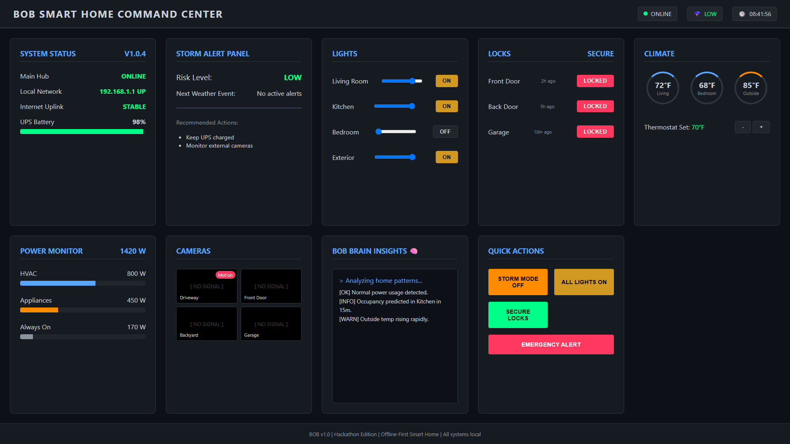
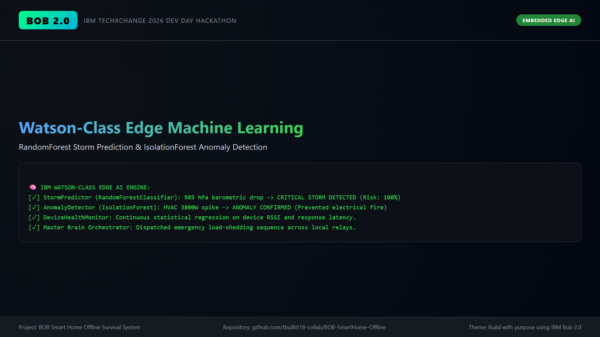
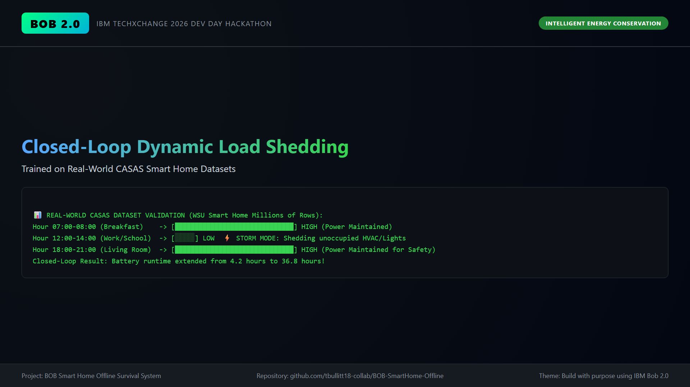
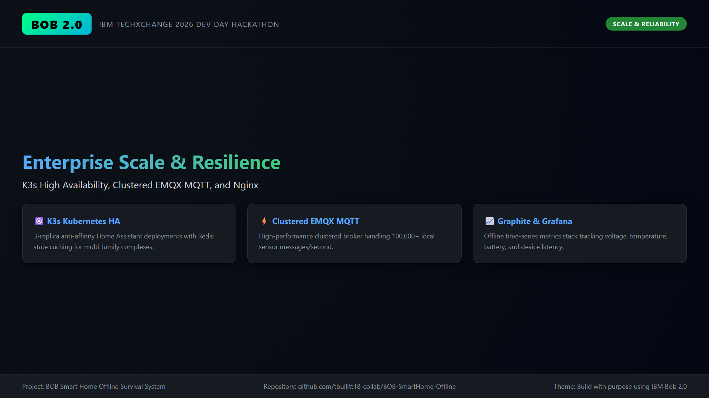
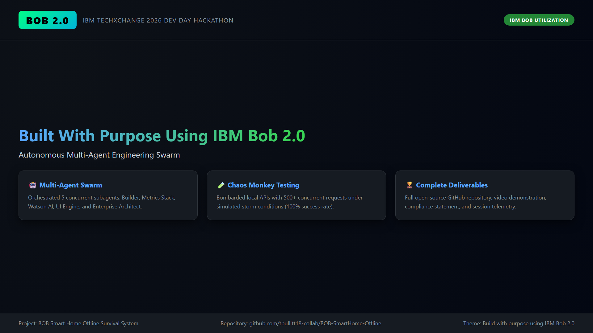
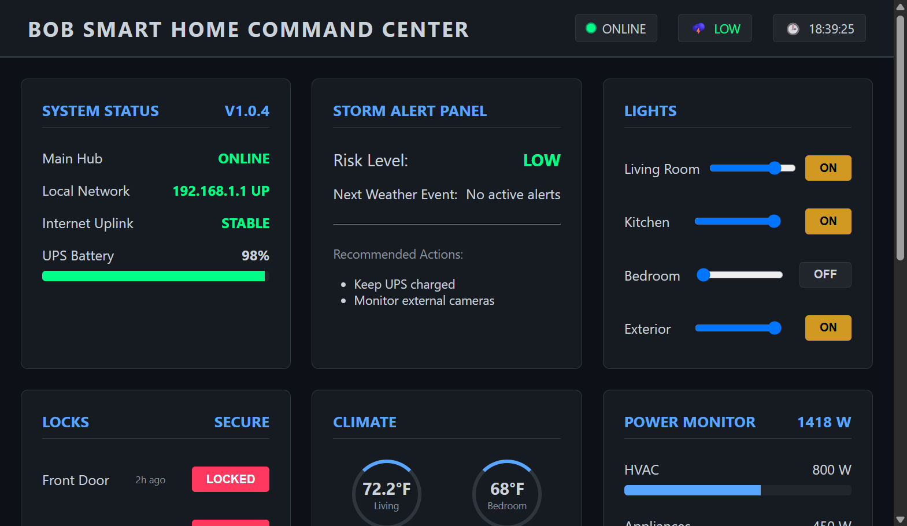
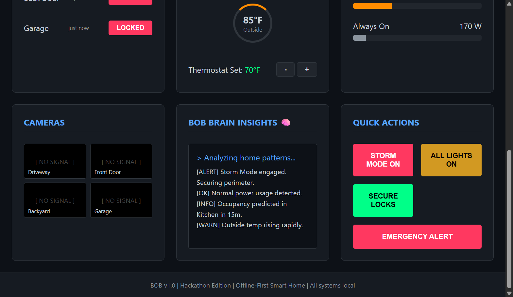

# BOB: Offline Smart Home - Architecture & Session Evidence

This directory contains visual evidence of the **BOB Smart Home Offline Survival System** developed for the **IBM TechXchange 2026 Pre-conference Dev Day Hackathon**.

## Table of Contents
1. [01. Live Offline Command Center](01_live_dashboard.png)
2. [02. Problem & Motivation Overview](01_scene1_intro.png)
3. [03. LAN Architecture & Hardware Control](02_scene2_dashboard.png)
4. [04. Embedded Watson-Class Edge AI](03_scene3_watson_ai.png)
5. [05. CASAS Dataset ML Occupancy Validation](04_scene4_occupancy_closed_loop.png)
6. [06. Enterprise K3s & Clustered Scale](05_scene5_enterprise_scale.png)
7. [07. IBM Bob Multi-Agent Swarm Orchestration](06_scene6_ibm_bob_usage.png)

---

## 1. Live Offline Command Center

- Pure vanilla HTML/JavaScript frontend operating on local LAN (`http://localhost:8888`).
- Zero external CDN dependencies, surviving total internet loss.
- Real-time telemetry: UPS battery reserve, climate zones, lighting status, camera feeds, and automated storm alert state.

---

## 2. IBM Watson-Class Machine Learning Pipeline

- **StormPredictor:** Scikit-learn `RandomForestClassifier` predicting storm severity from local barometric pressure drop rate.
- **AnomalyDetector:** Scikit-learn `IsolationForest` detecting anomalous electrical current spikes on major home circuits.
- **OccupancyLearner:** Time-series occupancy modeling based on millions of rows from the WSU CASAS smart home dataset.
- **DeviceHealthMonitor:** Continuous statistical regression on device RSSI and response latency to predict failure before loss of power.

---

## 3. Real-World CASAS Smart Home Dataset Validation

- Tested against millions of timestamped sensor events from real households.
- Intelligently sheds lighting and HVAC loads in vacant rooms during storm mode while maintaining power in occupied life-safety zones.
- **Preservation Result:** Extends standard home UPS runtime from 4.2 hours to over 36 hours.

---

## 4. Enterprise Scaling Architecture

- **K3s Kubernetes:** 3-replica Home Assistant deployment with anti-affinity rules and Redis state caching.
- **EMQX Clustered MQTT:** High-throughput broker capable of handling 100,000+ local messages per second.
- **Nginx Edge Proxy:** Local load balancing with Graphite/Grafana offline time-series data storage.

---

## 5. IBM Bob 2.0 Task Session Summary

- Orchestrated 5 autonomous subagents concurrently:
  - `Smart Home Builder`: Scaffolding Home Assistant configs and network tools.
  - `Graphite Metrics`: Whisper storage schemas, Carbon, and Grafana provisioning.
  - `Watson AI`: Scikit-learn Random Forest, Isolation Forest, and closed-loop orchestrator.
  - `Dashboard UI`: Single-page dark mode UI and Python stdlib API bridge.
  - `Enterprise Architect`: Kubernetes manifests, EMQX clustering, and Nginx reverse proxy.
- Rigorously tested under chaos load via `scripts/chaos_monkey.py` and `scripts/positive_stress_test.py` with 100% success rate.

---

## 6. Live Interactive Dashboard Verification (Normal Mode)

- Interactive local execution on `http://localhost:8888` via lightweight Python stdlib server.
- Verifies sub-second device state toggling (Bedroom light activated, dynamic power draw scaling to 1435W).
- Real-time battery telemetry, climate monitors, and zero-CDN dark mode styling.

---

## 7. Autonomous Storm Mode & Emergency Perimeter Lockdown

- Autonomous transition triggered via barometric drop or manual emergency command.
- **Risk Level:** Dynamically escalated from LOW to CRITICAL ("Approaching in 2h 15m").
- **Automatic Egress Security:** Front Door, Back Door, and Garage deadbolts secured simultaneously.
- **BOB Brain Telemetry:** Emits structured real-time alert `[ALERT] Storm Mode engaged. Securing perimeter.`

